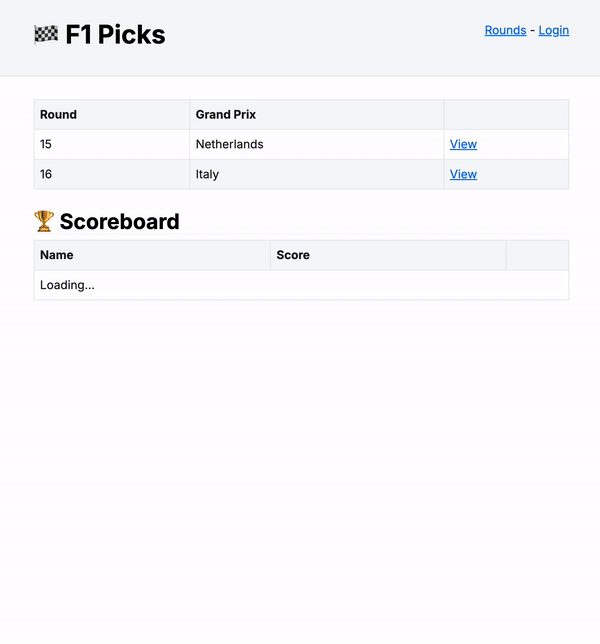

# F1 Picks (NextJS)

I wanted an excuse to play with NextJS 14 (App Router, RSC, Server Actions etc.), Lambda Web Adaptor and CDK; so I thought reimplementing the previous [F1 picks](https://github.com/eddmann/f1-picks) project I built would be a good use-case 🏎️ 💨

This project uses the following technologies:

- NextJS 14 - App Router, React Server Components, Suspense, Response Streaming, Server Actions
- Prisma (for persistence)
- NextAuth.js (for Google OAuth login)
- Deployment on Lambda (via [Lambda Web Adaptor](https://github.com/awslabs/aws-lambda-web-adapter)), fronted by CloudFront using CDK
- Untested, domain, persistence and presentation code soup... ala 2000's PHP 😬.

## Inspiration

- https://frontendmasters.com/courses/next-js-v3/
- https://frontendmasters.com/courses/intermediate-next-js/
- https://github.com/aws-samples/trpc-nextjs-ssr-prisma-lambda
- https://blog.barnabycollins.com/web-dev/2023/12/22/how-to-host-nextjs-14.html
- https://github.com/awslabs/aws-lambda-web-adapter/tree/main/examples/nextjs
- https://github.com/awslabs/aws-lambda-web-adapter/tree/main/examples/nextjs-zip
